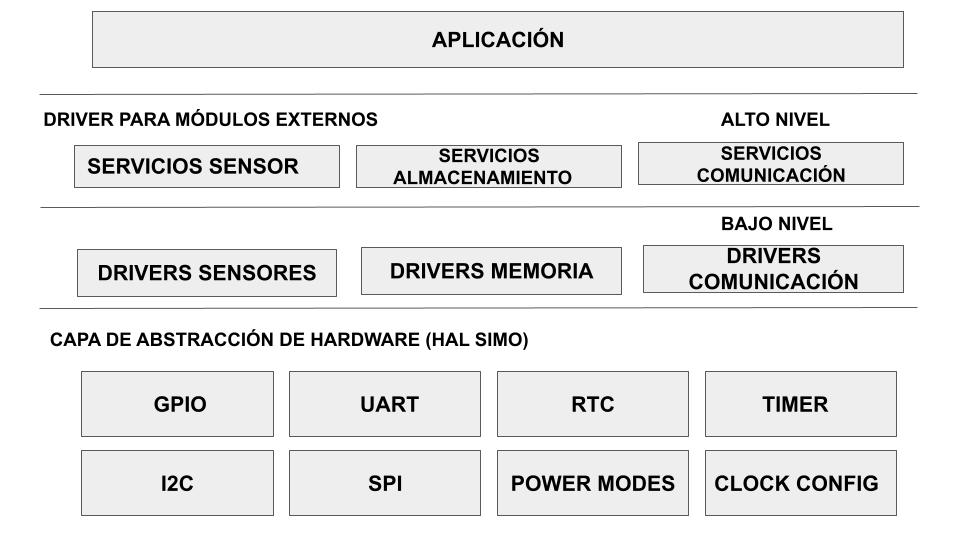
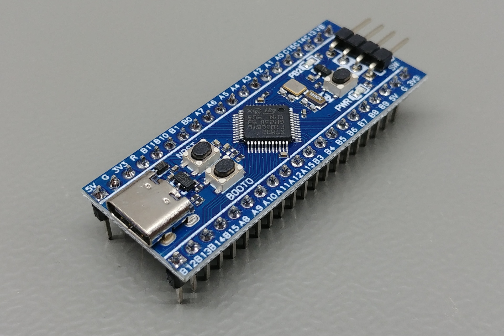
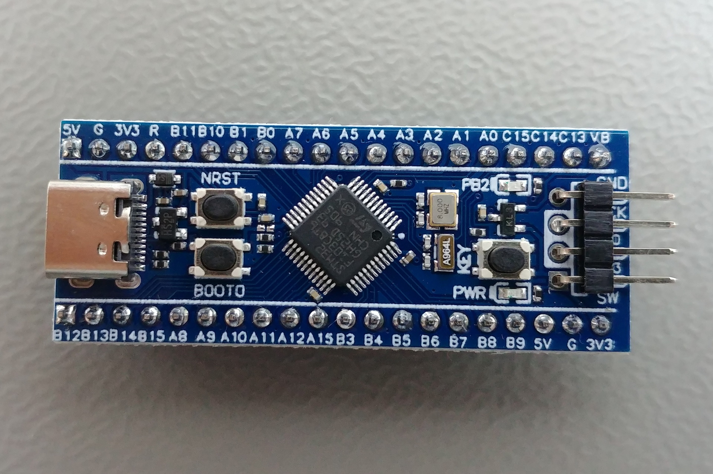

## Proyecto en construccion.

 


<h2>
    Trabajo final para la carrera de especialista en sistemas embebidos: 
    Sistema de telemetría para usos en investigación.
</h2>

## Alumno: German Velardez

### Breve resumen del proyecto a realizar:


<p>Se pretende diseñar el firmware para un dispositivo modular. La arquitectura del mismo debe tener una estructura en capas.
</p>


 <h4 align="center">Diagrama simple del sistema</h4>
 <div align="center" >

</div>

### El proyecto esta basado en un microcontrolador en STM32F103CB.

 <h4 align="center">Vista lateral de la placa</h4>
 <div align="center" >

</div>

 <h4 align="center">Vista superior la placa</h4>
 <div align="center" >

</div>


 <lu>
    <li>
             <a HREF="https://stm32-base.org/boards/STM32F103C8T6-WeAct-Blue-Pill-Plus-Clone.html">Placa de desarrollo utilizada</a>
    </li> 
</lu>

### Herramienta Necesarias
Asegurese de tener instalado las siguientes herramientas :

<lu>
    <li>
      Herramienta para compilar: 
      <a HREF="https://www.gnu.org/software/make/">make</a>      
    </li> 
    <li>
       Compilador ARM:
      <a HREF="https://developer.arm.com/tools-and-software/open-source-software/developer-tools/gnu-toolchain/gnu-rm/downloads">arm-none-eabi-gcc</a> 
    </li> 
</lu>


Para compilar el proyecto ejecute el siguiente comando:
``` 
    make
```

Para cargar el proyecto al microcontrolador mediante el stlink ejecute el siguiente comando:
``` 
    ./runCode.sh
```

 
 
 Para generar la documentacion necesita instalar Doxygen en su computadora. Comando de generacion:
```
    doxygen doc_config
 ```
 ### Documentacion del proyecto.
 <lu>
    <li>
             <a HREF="https://germanvelardez2018.github.io/SIMO-STM32-framework/">Documentacion</a>
    </li> 
</lu>